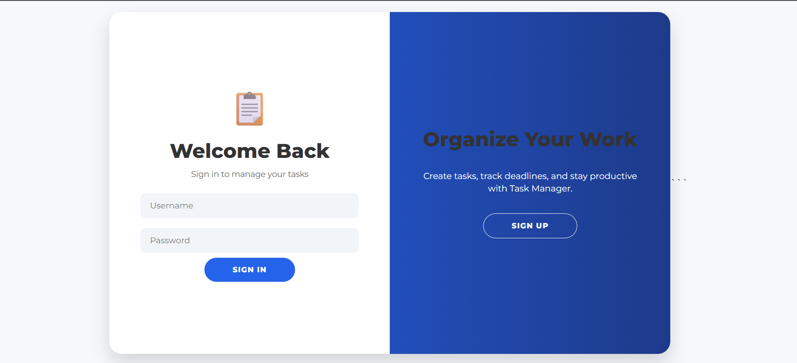
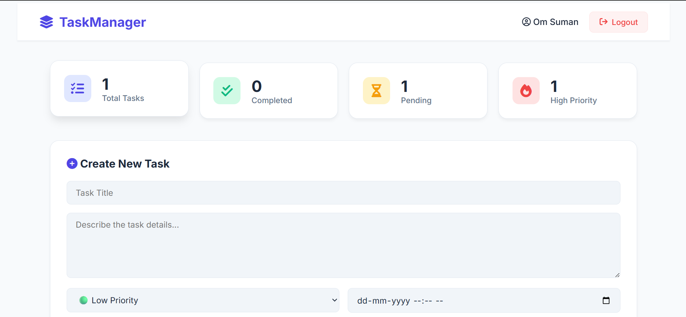

# Task Manager Web Application

## Overview

Task Manager is a Django-based web application that helps users organize, track, update, and manage their daily tasks efficiently. The application provides secure user authentication, task creation, task updates, task deletion, priority management, and deadline tracking through an intuitive user interface.

---

## Features

### Authentication System

* User Registration
* User Login
* User Logout
* Secure Password Handling
* Session Management

### Task Management

* Create New Tasks
* View All Tasks
* Update Existing Tasks
* Delete Tasks
* Set Task Priorities

  * Low Priority
  * Medium Priority
  * High Priority
* Assign Deadlines
* Mark Tasks as Completed
* User-specific Task Storage

### User Interface

* Modern Responsive Design
* Interactive Dashboard
* Priority Indicators
* Task Status Tracking
* Clean and User-Friendly Layout

---

## Technology Stack

### Frontend

* HTML5
* CSS3
* JavaScript
* Font Awesome

### Backend

* Django
* Python

### Database

* SQLite

---

## Project Structure

```text
TaskManager/
│
├── app/
│   ├── migrations/
│   ├── templates/
│   │   ├── home.html
│   │   ├── login.html
│   │   └── signup.html
│   ├── views.py
│   ├── models.py
│   ├── urls.py
│   └── admin.py
│
├── TaskManager/
│   ├── settings.py
│   ├── urls.py
│   └── wsgi.py
│
├── db.sqlite3
├── manage.py
└── README.md
```

---

## Installation

### Clone Repository

```bash
git clone <repository-url>
cd TaskManager
```

### Create Virtual Environment

```bash
python -m venv venv
```

### Activate Virtual Environment

#### Windows

```bash
venv\Scripts\activate
```

#### Linux/Mac

```bash
source venv/bin/activate
```

### Install Dependencies

```bash
pip install -r requirements.txt
```

### Apply Migrations

```bash
python manage.py makemigrations
python manage.py migrate
```

### Run Server

```bash
python manage.py runserver
```

Open:

```text
http://127.0.0.1:8000/
```

---

## Screenshots

### Authentication Page

 (screenshots/signup.png)

**Features**

* User Login
* User Registration
* Secure Authentication

---

### Home Dashboard

 (screenshots/home2.png)


**Features**

* Create New Task
* View Existing Tasks
* Task Priority Management
* Deadline Tracking
* Task Completion Status


## Database Design

### Task Model

| Field       | Type          |
| ----------- | ------------- |
| id          | AutoField     |
| user        | ForeignKey    |
| title       | CharField     |
| description | TextField     |
| priority    | IntegerField  |
| deadline    | DateTimeField |
| completed   | BooleanField  |

---

## Future Enhancements

* Email Notifications
* Task Categories
* Search and Filter Tasks
* Dark Mode
* REST API Integration
* Mobile Application
* Task Analytics Dashboard

---

## Learning Outcomes

Through this project, the following concepts were implemented:

* Django MVT Architecture
* Authentication and Authorization
* CRUD Operations
* Database Management
* URL Routing
* Template Rendering
* Form Handling
* Frontend Integration with Django

---

## Author

**Om Suman**

B.Tech Student | Machine Learning & Software Development Enthusiast

---

## License

This project is developed for educational and learning purposes.
